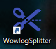
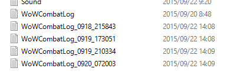

WowLog Splitter
===========

Splitter in Python for a large WoWCombatLog to upload combat log analysis site.


Usage
-----

### Windows

1. Download installer such as `WowlogSpliter-0.x.x-amd64.msi` from [releases page](https://github.com/mureth/wowlog-splitter/releases)
2. Run the installer to setup program then following icon will be appeared on your desktop.

3. Drag & drop your `WoWCombatLog.txt` file in Log folder such as `C:\Program Files (x86)\World of Warcraft\Logs` to the icon on your desktop.
4. Then splitted log files will be created on same folder of original `WoWCombatLog.txt`.


### OSX

1. Download `splitter.py` to your computer.
2. Run below command.

```shell
$ python splitter.py /path/to/WoWCombatLog.txt
```

Logic
-----

The splitter divides WoWCombatLogs.txt based on interval of combat log events.
If interval of event timestamps is over than **2 hours**, the splitter creates a new file and starts writing event lines from the original combat log file.


Acknowledgement
-----

Icon made by <a href="http://www.freepik.com" title="Freepik">Freepik</a> from <a href="http://www.flaticon.com" title="Flaticon">www.flaticon.com</a> is licensed under <a href="http://creativecommons.org/licenses/by/3.0/" title="Creative Commons BY 3.0">CC BY 3.0</a>
